# Biohub Cell Tracking During Development

**A research pipeline for detecting cells in 3D microscopy and reconstructing their lineages over time.** Built for the [Biohub Kaggle competition](https://www.kaggle.com/competitions/biohub-cell-tracking-during-development), with an emphasis on reproducible evaluation, anisotropic geometry, and auditable graph reconstruction.

Python 3.11 · PyTorch · NumPy/SciPy · Polars · Zarr · tracksdata

## Project highlights

- Adapted the official temporal 3D UNet and transformer association baseline into training and inference workflows supporting CUDA, Apple MPS, and CPU device selection.
- Built a reusable **Frozen V9** graph pipeline: division filtering, confidence-aware pruning, gap recovery, and component cleanup, with explicit immutable parameters.
- Used physical voxel spacing for geometric checks rather than assuming isotropic image coordinates.
- Locked dataset-level cross-validation across 199 datasets and five folds, balancing dataset prefix, density, and division distribution.
- Added deterministic graph tests, experiment utilities, structural audits, and a reproduction gate against the source-locked official evaluator.

The neural architecture and official evaluator come from [royerlab's competition repository](https://github.com/royerlab/kaggle-cell-tracking-competition). This repository contains the project-specific adaptations, graph policies, experiment tooling, and tests; it does not claim authorship of the upstream baseline.

## Pipeline

```mermaid
flowchart LR
    A[Lazy Zarr microscopy access] --> B[Temporal 3D UNet detection]
    B --> C[Transformer association]
    C --> D[Division geometry filter]
    D --> E[Confidence-aware pruning]
    E --> F[Single-edge gap recovery]
    F --> G[Two-edge isolated-middle recovery]
    G --> H[Component cleanup]
    H --> I[Lineage graph / GEFF]
    I --> J[Official evaluation / CSV checks]
```



Detection thresholds are **0.995 / 0.9975**. Inference uses detection flip TTA and physical pooling at **3 µm**. Frozen V9 does not use ILP association or synthetic node insertion. Training, ground-truth evaluation, and prediction-only submission execution are separate workflows.

## Verified local result

On **40 held-out Fold0 datasets**, a fresh run on September 28, 2026 reproduced the locked Warm2 Frozen V9 result with the official evaluator:

| Metric | Value |
|---|---:|
| Final score | **0.770921082** |
| Adjusted edge Jaccard | 0.767074928 |
| Raw edge Jaccard | 0.774393229 |
| Division Jaccard | 0.038461538 |
| Node recall | 0.956612481 |

This is **local baseline reproduction**, not a leaderboard score or a claimed new improvement. Division recovery remains a weakness. The reviewed Kaggle Notebook completed both inference passes and official CSV roundtrip checks. Kaggle accepted Version 2 on September 28, 2026; the last recorded competition status was `Notebook Running`, with no leaderboard score yet.

See [validation evidence and limitations](docs/VALIDATION.md), the [official reproduction transcript](docs/evidence/frozen_v9_reproduction.txt), and the [research design](docs/RESEARCH.md).

## Start here

| File | What to inspect |
|---|---|
| [`src/biohub_cell_tracking/frozen_v9.py`](src/biohub_cell_tracking/frozen_v9.py) | Frozen graph policies, physical geometry, and official evaluation |
| [`tests/test_frozen_v9.py`](tests/test_frozen_v9.py) | 40 deterministic tests using small in-memory graphs |
| [`scripts/train_unet_transformer_mps.py`](scripts/train_unet_transformer_mps.py) | Training, sparse-label loss, and device support |
| [`scripts/predict_unet_transformer_mps.py`](scripts/predict_unet_transformer_mps.py) | Detection TTA, association, and GEFF export |
| [`scripts/verify_frozen_v9.py`](scripts/verify_frozen_v9.py) | Official-metric reproduction and exact candidate/intervention checks |
| [`configs/cv_manifest.lock.json`](configs/cv_manifest.lock.json) | Locked cross-validation design |

The Stage11/Stage12 modules and scripts preserve research experiments and source contracts. They are not all promoted into the reviewed Frozen V9 submission, and some require historical local artifacts.

The [research notebooks](notebooks/README.md) now retain the exploratory cell sources, with execution outputs removed from the public copies. The [submission archive](notebooks/submission/README.md) includes the reviewed offline notebook, wheelhouse builder, and exact input hashes. [Historical recovery and legacy code](research/README.md) is preserved separately from the main pipeline. See the [file audit](docs/FILE_AUDIT.md) for the upload verification and local evidence retained during cleanup.

## Setup and tests

Install [uv](https://docs.astral.sh/uv/getting-started/installation/) and Git, then run:

```bash
git clone https://github.com/MapleBadger666/biohub-cell-tracking.git
cd biohub-cell-tracking
uv sync --locked --all-groups --python 3.11
uv run --no-sync python scripts/setup_official_source.py
uv pip install --no-deps -e external/official
export PYTHONPATH="$PWD/src:$PWD/scripts:$PWD/external/official/src:$PWD/external/official/scripts${PYTHONPATH:+:$PYTHONPATH}"
uv run --no-sync pytest -q tests/test_frozen_v9.py
```

The core suite needs no competition data or model weights. The full suite can be run with `uv run --no-sync pytest -q`; the published snapshot has **412 passing tests and two unresolved historical hash-contract failures**, detailed in [validation notes](docs/VALIDATION.md).

Full training and official-metric reproduction require competition access, the competition data, and separately obtained model weights. See [reproduction instructions](docs/REPRODUCING.md). These commands are not a promise of a data-free end-to-end reproduction.

## Repository scope

Included: reusable source, research scripts, tests, source-only exploratory and submission notebooks, split metadata, environment/input manifests, the dependency lock, and curated evidence. Competition images, annotations, weights, predictions, submission CSVs, wheel bundles, caches, local notebook outputs, and bulk experiment reports are excluded. The upstream official repository is fetched at its locked commit, not vendored or edited in place.

## Attribution

- Official competition code: [royerlab/kaggle-cell-tracking-competition](https://github.com/royerlab/kaggle-cell-tracking-competition), locked at `075fc5f5a52d11077f9dc2b074644618f26939e2`; upstream BSD-3-Clause license applies to upstream material.
- Graph and tracking infrastructure: [royerlab/tracksdata](https://github.com/royerlab/tracksdata).
- Source provenance is retained in migrated functions. See [third-party notices](THIRD_PARTY_NOTICES.md).
